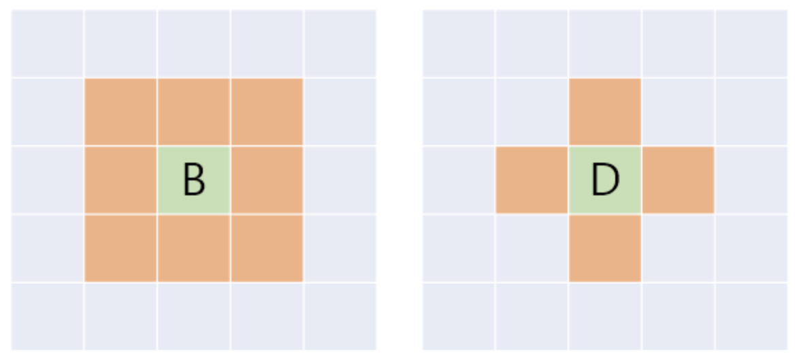



* Print who can go to destination first
  * 

```txt
Input:
3 5
1 1
2 3

Output: bessie
```



```go
package main

import "fmt"

func abs(x int) int {
  if x < 0 {
    return -x
  }
  return x
}

func max(a, b int) int {
  if a > b {
    return a
  }
  return b
}

func main() {
  var br, bc, dr, dc, jr, jc int
  fmt.Scan(&br, &bc, &dr, &dc, &jr, &jc)
  b := max(abs(br-jr), abs(bc-jc))
  d := abs(dr-jr) + abs(dc-jc)
  switch {
  case b < d:
    fmt.Printf("bessie")
  case b > d:
    fmt.Printf("daisy")
  default:
    fmt.Printf("tie")
  }
}
```



```py
a, b = map(int, input().split())
c, d = map(int, input().split())
e, f = map(int, input().split())
x = max(abs(e - a), abs(f - b))
y = abs(e - c) + abs(f - d)
if x == y:
  print('tie')
elif x < y:
  print('bessie')
else:
  print('daisy')
```


