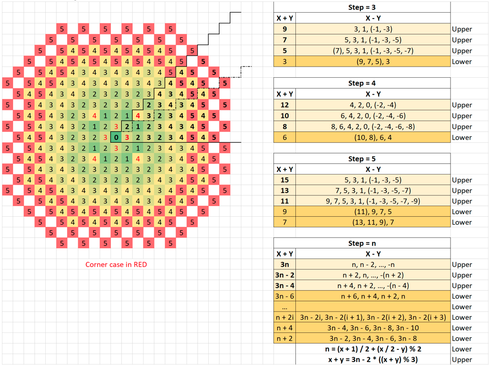



* Only look at 1/8 section
* <https://leetcode.com/problems/minimum-knight-moves/discuss/682850/C%2B%2B-O(1)-Formula-solution-with-plot-explanation>
* 

```cpp
class Solution {
public:
  int minKnightMoves(int x, int y) {
    // Adjust to 1/8.
    if (x < 0) { x = -x; }
    if (y < 0) { y = -y; }
    if (x < y) { swap(x, y); }

    if (x == 1 && y == 0) { return 3; }
    if (x == 2 && y == 2) { return 4; }

    if (y <= x / 2) {
      return (x + 1) / 2 + (x / 2 - y) % 2;  // Lower part.
    } else {
      return (x + y) / 3 + (x + y) % 3;      // Higher part.
    }
  }
};
```



```py
def minKnightMoves(self, x: int, y: int) -> int:
  @lru_cache(None)
  def DP(x, y):
    if x + y == 0:
      return 0
    elif x + y == 2:
      return 2
    return min(DP(abs(x - 1), abs(y - 2)), DP(abs(x - 2), abs(y - 1))) + 1
  return DP(abs(x), abs(y))
```


