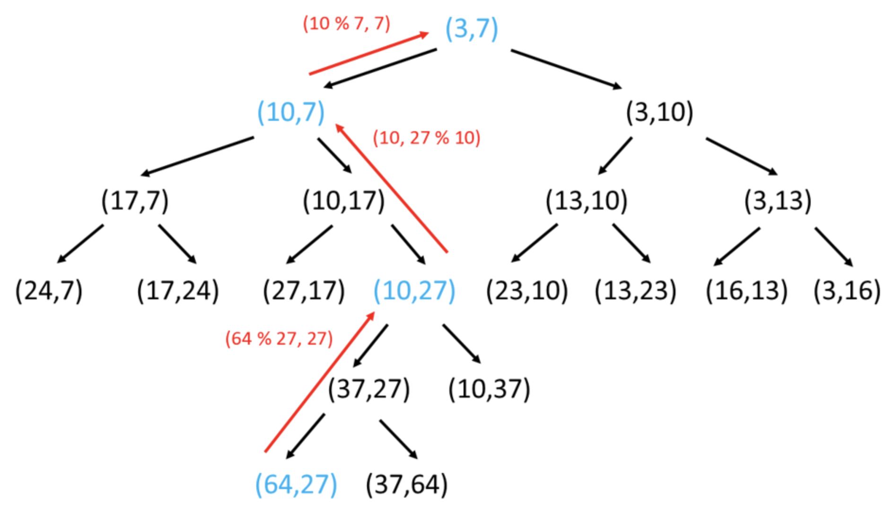

* 

```py
def reachingPoints(self, sx, sy, tx, ty):
  if tx < sx or ty < sy:
    return False
  if sx == tx:
    return (ty - sy) % sx == 0
  if sy == ty:
    return (tx - sx) % sy == 0

  if tx > ty:
    return self.reachingPoints(sx, sy, tx % ty, ty)
  else:
    return self.reachingPoints(sx, sy, tx, ty % tx)
```
