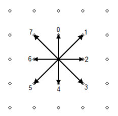





```txt
Input:
19
6664442220001655360
Output: 3
```

* Print number of rooms after moving as following



```cpp
#include <bits/stdc++.h>
#define x first
#define y second
using namespace std;

typedef pair<int, int> p;
typedef pair<p, p> pp;
const int di[] = {-1, -1, 0, 1, 1, 1, 0, -1};
const int dj[] = {0, 1, 1, 1, 0, -1, -1, -1};

set<p> nd;
set<pp> edg;

int solution(vector<int> arr) {
  int n = arr.size();
  p t = {0, 0}; nd.insert(t);
  for(auto i : arr) for(int j=0; j<2; j++){
    int x = t.x + di[i];
    int y = t.y + dj[i];
    p prv = t; t = {x, y};
    nd.insert(t);
    edg.insert({min(prv, t), max(prv, t)});
  }
  return edg.size() - nd.size() + 1;
}

int main(){
  ios_base::sync_with_stdio(0); cin.tie(0);
  int n; cin >> n; vector<int> v(n);
  for(int i=0; i<n; i++){
    char c; cin >> c;
    v[i] = c - '0';
  }
  cout << solution(v);
}
```


