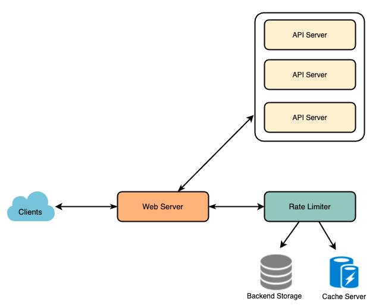

# Rate Limiter

* Rate Limiter:
  * <https://gist.github.com/saisandeep/e6334e293bba6a41fb0081f5a39a091e#file-sliding-window-counters-redis-py>

* Rationale
  * Misbehaving clients: Intentionally/unintentionally, some entities can overwhelm service by sending large # of requests
    * ex: Denial-of-service (DOS) attacks
  * Security: By limiting the number of the second-factor attempts (ex: Bruteforce password attempts/credit card transactions)
  * To prevent bad design practices (ex: Asking same information over and over again)
  * To keep costs and resource usages (ex: Eliminate spikiness in traffic)
  * Create a revenue model based on rate limiting

* Functional Requirements:
  * Limit the number of requests an entity can send to an API within a time window, e.g., 15 requests per second.
  * APIs are accessible through a cluster, so rate limit should be considered across different servers
  * User should get an error message when cross defined threshold within single server or across combination of servers

* Non-Functional Requirements:
  * The system should be highly available, should always work since it protects our service from external attacks
  * Our rate limiter should not introduce substantial latencies affecting the user experience.

## Architecture

* Sliding window: Keep track of each request/user, store time of request in Redis Sorted Set in ‘value’ field of hash-table

* How should we limit
  * IP: If we have to rate limit on the login API itself?
  * User: Multiple users share a single public IP like in an internet cafe or smartphone users that are using same gateway

* How to keep atomicity
  * Read-and-then-write behavior can create a race condition.

## Database

* 
