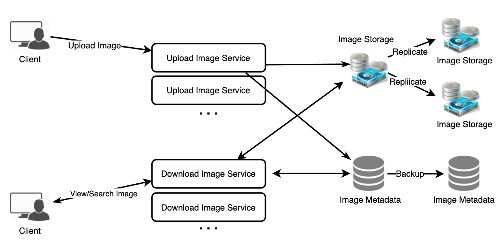

# Requirement

* Functional Requirements
  * Users should be able to upload/download/view photos.
  * Users can perform searches based on photo/video titles.
  * Users can follow other users.
  * System should generate and display user’s News Feed consisting of top photos from all the people the user follows

* Non-functional Requirements
  * Our service needs to be highly available.
  * The acceptable latency of the system is 200ms for News Feed generation.
  * Consistency can take hit (in interest of availability) if user doesn’t see photo for a while; it should be fine
  * The system should be highly reliable; any uploaded photo or video should never be lost.

* Capacity estimation
  * 500M total users, with 1M daily active users
  * 2M new photos every day
  * Average photo file size => 200KB
  * Total space required for 1 day of photos 400 GB
  * 400GB x 365 (days a year) x 10 (years) ~= 1425TB

* <https://www.educative.io/courses/grokking-the-system-design-interview/m2yDVZnQ8lG>

## Architecture

* What are the different approaches for sending News Feed contents to the users?
  * Pull: Clients pull News-Feed contents from the server at a regular interval or manually whenever they need it
  * Push: Servers can push new data to the users as soon as it is available
    * Maintain a Long Poll request with the server for receiving the updates
    * [-] Celebrity user who has millions of followers

## Database

* 

* Photos in a distributed file storage like HDFS or S3

* Photo
  * PhotoID: int
  * UserID: int
  * PhotoPath: varchar (256)
  * PhotoLatitude: int
  * PhotoLongitude: int
  * UserLatitude: int
  * UserLongitude: int
  * CreationDate: datetime

* User
  * UserID: int
  * Name: varchar(20)
  * Email: varchar(32)
  * DateOfBirth: datetime
  * CreationDate: datetime
  * LastLogin: datetime

* UserPhoto
  * UserID
  * PhotoID

* UserFollow
  * UserID1: int
  * UserID2: int

* Sharding
  * Based on UserID: shard number by UserID % 10
    * [-] Hot User
  * Based on PhotoID
    * Separate database instance to generate auto-incrementing IDs

* Failure on Photo ID Generation Server?
  * Two one for even one for odd to prevent failuer
