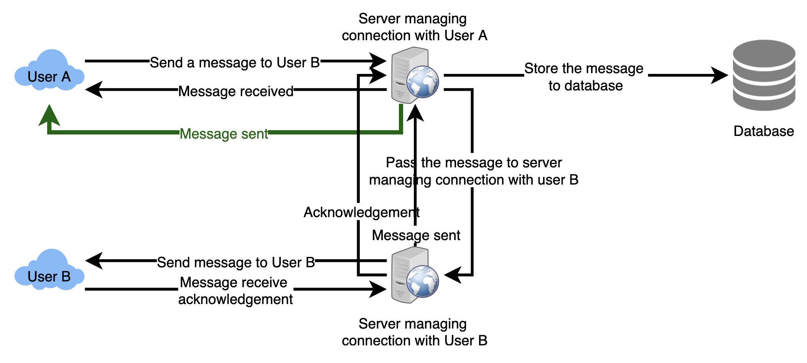
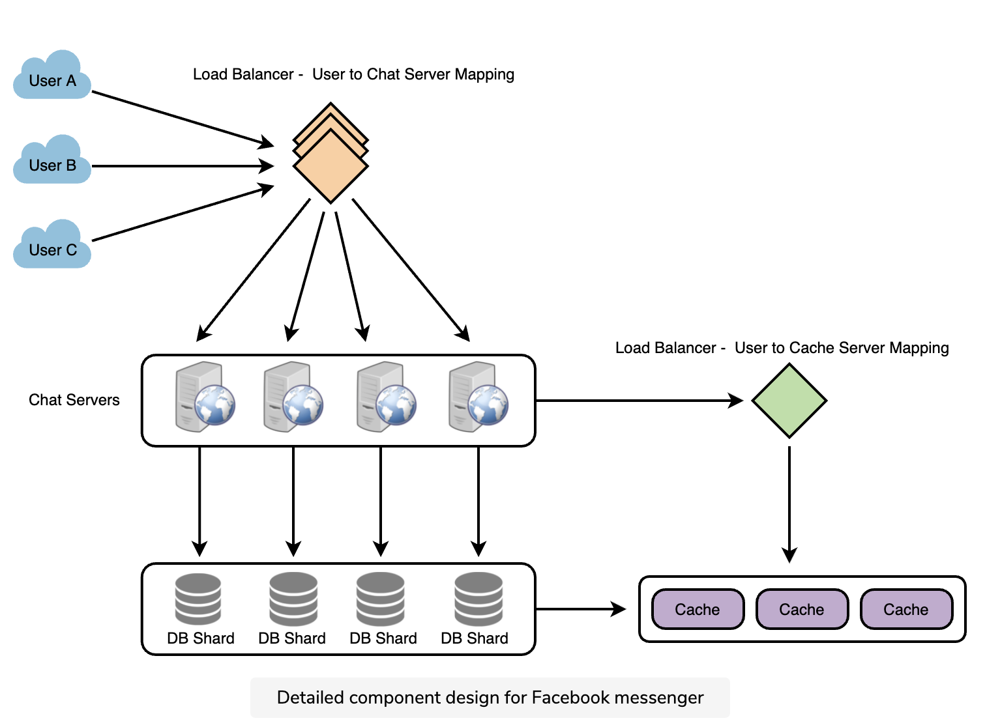

# Messenger

* Messenger:
  * <https://www.youtube.com/watch?v=zKPNUMkwOJE>
  * <https://www.youtube.com/watch?v=uzeJb7ZjoQ4>

* Functional Requirements:
  * Messenger should support one-on-one conversations between users.
  * Messenger should keep track of the online/offline statuses of its users.
  * Messenger should support the persistent storage of chat history.
  * Group Messaging
  * Sent + Delievered + Read Recept
  * Online / Last Seen
  * Image Sharing
  * Chats are Temporary / Permanent

* Non-functional Requirements:
  * Users should have a real-time chatting experience with minimum latency.
  * Our system should be highly consistent; users should see the same chat history on all their devices.
  * Messenger’s high availability is desirable; we can tolerate lower availability in the interest of consistency.

* Extended Requirements:
  * Group Chats: Messenger should support multiple people talking to each other in a group.
  * Push notifications: Messenger should be able to notify users of new messages when they are offline.

## Architecture

* Maintain sequence
  * 
  1. User-1 sends a message M1 to server for User-2
  1. Server receives M1 at T1
  1. Meanwhile, User-2 sends a message M2 to server for User-1
  1. Server receives message M2 at T2, such that T2 > T1
  1. Server sends the message M1 to User-2 and M2 to User-1

* Deliver message request
  1. Store the message in the database
  1. Send the message to the receiver
  1. Send an acknowledgment to the sender.

* Retrieving message from database
  * Start a separate thread, which will work with the database to store the message
  * Send an asynchronous request to the database to store the message

* How would we efficiently send/receive messages?
  * Pull model: Users periodically ask the server if there are any new messages for them
  * Push model: Users keep connection open with server and can depend upon the server to notify them when new messages

* How can the server keep track of all the opened connections to efficiently redirect messages to the users?
  * The server can maintain a hash table, where “key” would be the UserID and “value” would be the connection object
  * When server receive message for user, looks up in hash table to find connection object, sends message on open request

* How many chat servers do we need?
  * 500 million connections at any time
  * Assuming a modern server can handle 50K concurrent connections at any time, need 10K such servers.

* How do we know which server holds the connection to which user?
  * Software load balancer in front of our chat servers
  * That can map each UserID to a server to redirect the request

* How should clients efficiently fetch data from the server?
  * Clients should paginate while fetching data from the server
  * Page size could be different for different clients (ex: small cell phones, so fewer messages/conversations in viewport)

* How does the messenger maintain the sequencing of the messages?
  * Store a timestamp with each message, which is the time when the server receives the message
    * [-] Not ensure the correct ordering of messages for clients
  * Keep a sequence number with every message for each client

## Database

* 
* 
* Wide-column database solution like HBase
* CDN: Caching for media file

* User
  * id: primary key, sequential
  * username: string
  * last_active: timestamp

* Message
  * id: primary key, sequential
  * user, foreign key
  * conversation: int
  * text: string
  * media_url: string

* conversation
  * id: int
  * name: string

* conversation_users
  * conversation: foreign key
  * user: foreign key
