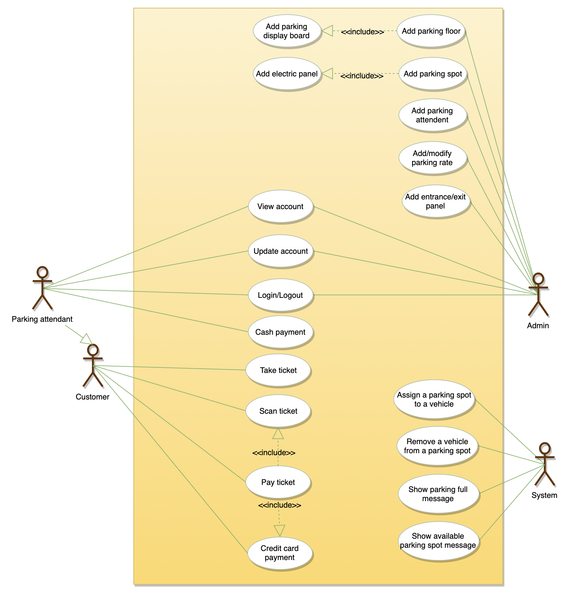
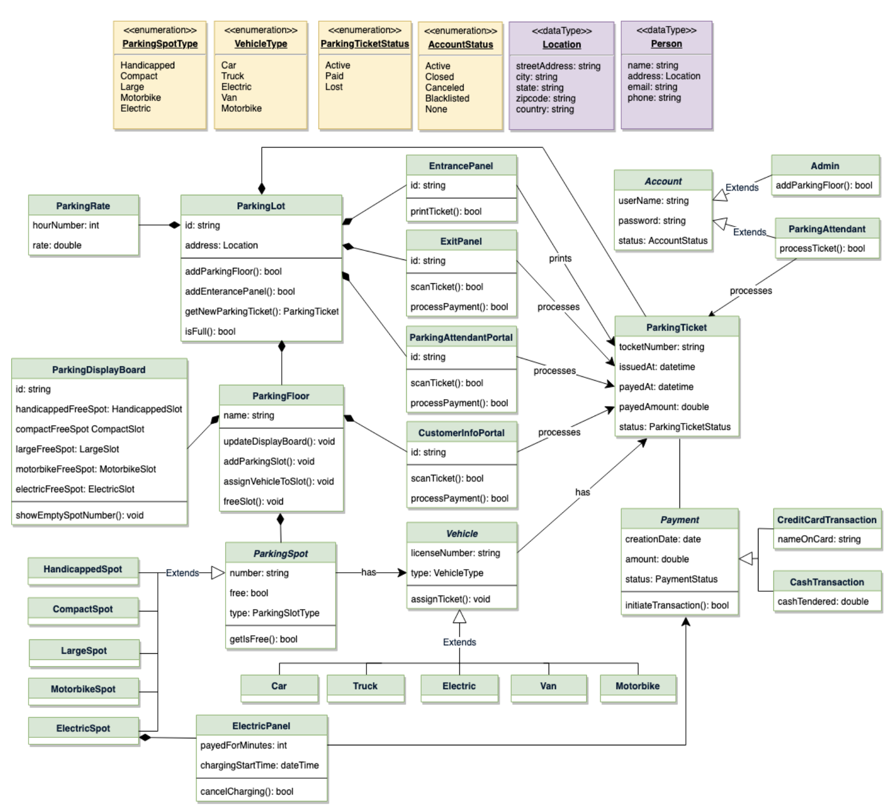
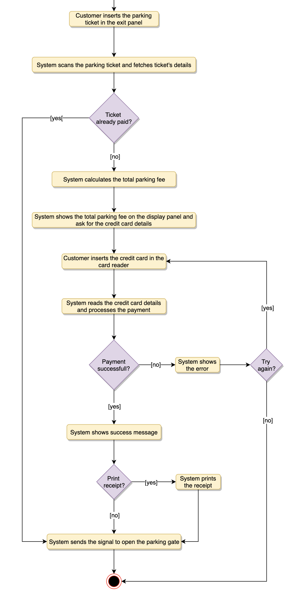

# Requirements

* Parking Lots:
  * <https://www.youtube.com/watch?v=NtMvNh0WFVM>
  * 
  * 
  * 

* public reserve(): (string spot_id, string reservation_id)
  * string: floor_id
  * string: start_time
  * string: end_time

* public payment(): (boolean success)
  * string reservation_id
  * Third party

* public cancel(): (boolean success)
  * string reservation_id

* public signin()
* public signup()
* public signout()
  * Third party

* private allocate_spot()
  * string floor_id
  * string vehicle_type
  * string time

* private calculate_payment()
  * string reservation_id

* private freespots()
  * string floor_id
  * string vehicle_type
  * string time
  * Should smaller types might fit into larger spot

## Architecture

* Strong Consistency
* Load Balancer: Based on zip code
* Read Replica of Database since we have more reads than write

## Database

* Reservation
  * id: primary key, serial
  * floor_id: foreign key, int
  * spot_id: foreign key, int
  * start: timestamp
  * end: timestamp
  * paid: boolean

* Garage
  * id: primary key, serial
  * zipcode: varchar
  * n_compact: number
  * n_reg: number
  * n_large: number

* Spots
  * id: primary key, serial
  * garage_id: foreign key, int
  * status: enum
  * vehicle_type: enum

* Users
  * id: primary key, serial
  * email: varchar
  * password: varchar
  * first_name: varchar
  * last_name: varchar

* Vehicles
  * id: primary key, serial
  * user_id: foreign key
  * license: varchar
  * vehicle_type: enum
