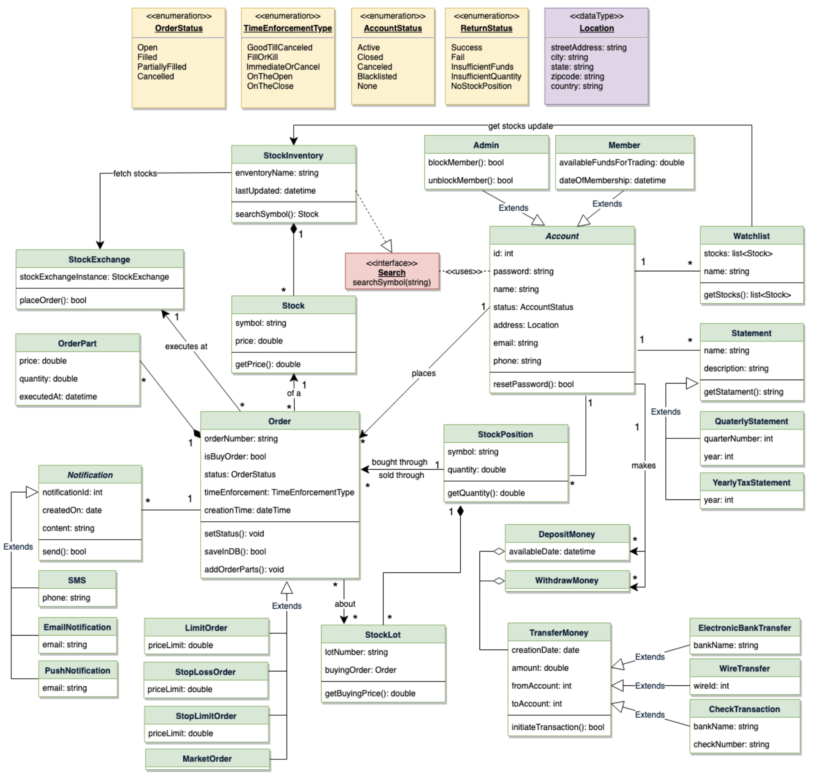

# Requirements

* 
* Any user of our system should be able to buy and sell stocks.
* Any user can have multiple watchlists containing multiple stock quotes.
* Users should be able to place stock trade orders of following types: 1) market, 2) limit, 3) stop loss, 4) stop limit
* Users can have multiple `lots` of stock
  * If user has bought stock multiple times, system should be able to differentiate between different lots of same stock
* The system should be able to generate reports for quarterly updates and yearly tax statements.
* Users should be able to deposit and withdraw money either via check, wire, or electronic bank transfer.
* The system should be able to send notifications whenever trade orders are executed.

## Architecture

* 
