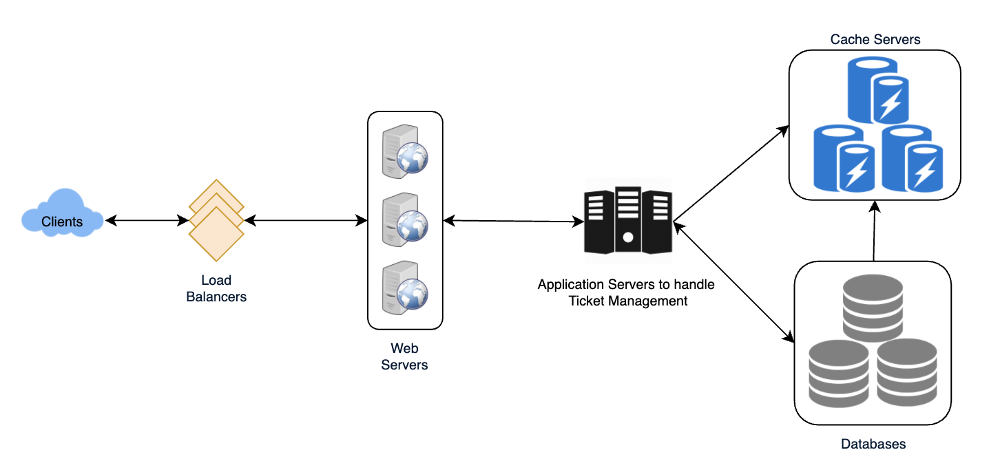
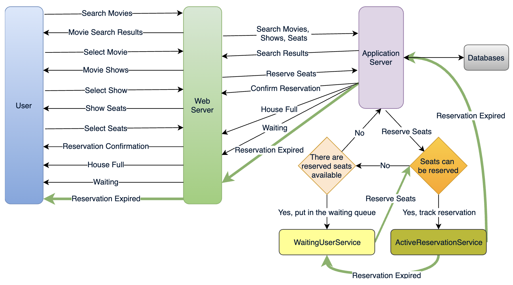
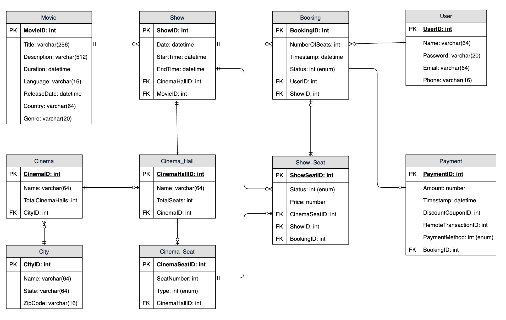

# Requirement

* TicketMaster:
  * <https://www.educative.io/courses/grokking-the-system-design-interview/YQyq6mBKq4n>

* Functional Requirements:
  * Our ticket booking service should be able to list different cities where its affiliate cinemas are located
  * Once the user selects the city, service should display the movies released in that particular city
  * Once the user selects a movie, service should display the cinemas running that movie and its available showtimes
  * User can choose a show at a particular cinema and book their tickets.
  * Service can show the user the seating arrangement of the cinema hall
  * User can select multiple seats according to their preference
  * User can distinguish available seats from booked ones
  * Users should be able to put a hold on the seats for five minutes before they make a payment to finalize the booking.
  * User can wait if there is a chance that the seats might become available, (ex: when holds by other users expire)
  * Waiting customers should be serviced in a fair, first come, first serve manner.

* Non-Functional Requirements:
  * System must be highly concurrent (will be multiple booking requests for same seat at any particular point in time)
  * Service should handle this gracefully and fairly
  * Core thing of the service is ticket booking, which means financial transactions (secure and database ACID compliant)
  * For simplicity, let’s assume our service does not require any user authentication.
  * The system will not handle partial ticket orders. Either user gets all the tickets they want or they get nothing.
  * Fairness is mandatory for the system.
  * To stop system abuse, we can restrict users from booking more than ten seats at a time.
  * Can assume that traffic would spike on popular/much-awaited movie releases and the seats would fill up pretty fast
  * The system should be scalable and highly available to keep up with the surge in traffic.

## Architecture

* Overall Architecture
  * 

* User Flow
  * 

* How to guarantee no two user book same seat

  ```sql
  SET TRANSACTION ISOLATION LEVEL SERIALIZABLE;

  BEGIN TRANSACTION;

    -- Suppose we intend to reserve three seats (IDs: 54, 55, 56) for ShowID=99
    Select * From Show_Seat where ShowID=99 && ShowSeatID in (54, 55, 56) && Status=0 -- free

    -- if the number of rows returned by the above statement is three, we can update to
    -- return success otherwise return failure to the user.
    update Show_Seat ...
    update Booking ...

  COMMIT TRANSACTION;
  ```

* How would the server keep track of all the active reservations that haven’t been booked yet and the waiting customers?
  * ActiveReservationService
    * Two daemon services, one to keep track of all active reservations and remove any expired reservation from system
  * WaitingUserService
    * Keeping track of all the waiting user requests
    * As soon as the required number of seats become available, it will notify (longest waiting) user to choose seats

* What happen when expire?
  1. Update the database to remove the Booking (or mark it expired) and update the seats’ Status in ‘Show_Seats’ table.
  1. Remove the reservation from the Linked HashMap
  1. Notify the user that their reservation has expired
  1. Broadcast message to WaitingUserService servers, holding waiting users of show to find longest waiting user
      * Consistent Hashing scheme will tell what servers are holding these users
  1. Send a message to WaitingUserService server holding longest waiting user to process their request

## Database

* 

* Database partitioning
  * Partition by ‘MovieID’
    * [-] For a very hot movie, this could cause a lot of load on that server
  * ActiveReservationService and WaitingUserService partitioning

* How to make ActiveReservationService and WaitingUserService fault tolerant?
  * primary-secondary configuration so that, when the primary crashes, the secondary can take over
