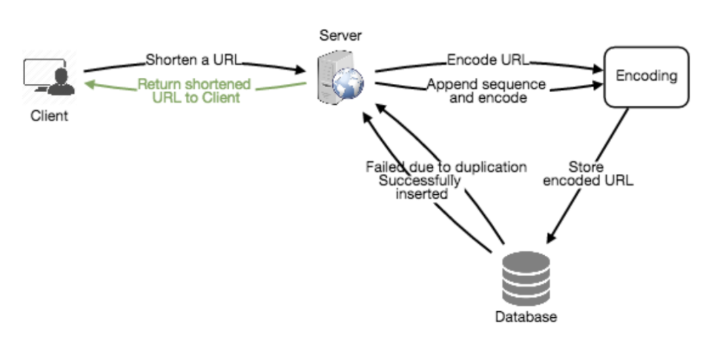

# Requirement

* Functional
  * Given a URL, service should generate a shorter and unique alias of it, called a short link
  * This link should be short enough to be easily copied and pasted into applications
  * When users access a short link, service should redirect them to the original link
  * Users should optionally be able to pick a custom short link for their URL
  * Links will expire after a standard default timespan → specify the expiration time

* Non-Functional Requirements
  * The system should be highly available →  if service is down, all the URL redirections will fail
  * URL redirection should happen in real-time with minimal latency
  * Shortened links should not be guessable (not predictable)

* Extended Requirements
  * Analytics; e.g., how many times a redirection happened?
  * Our service should also be accessible through REST APIs by other services

* Traffic Estimation
  * read
    * read query per second (20,000)
    * reading data (20,000 x 500 bytes = 10MB/s)
  * write
    * write query per second (200)
    * incoming data (200 x 500 bytes = 100KB/s)
    * 10M new URL per day, 5 years to store
* storage: storage needed (ex: 10M x 5 year x 500 bytes = 15TB)
  * size of URL object: 500 bytes
  * len: base64 encoding (ex: base64: 68.7b = 64 ^ 6)
  * memory: cache for 20% per day w/o dup (20,000 x 1day x 500bytes x 0.2 = 170G)

## Architecture

* createURL(): A successful insertion returns the shortened URL; otherwise, it returns an error code
  * str api_dev_key: API key of a registered account to throttle users based on quota
  * str original_url: Original URL to be shortened
  * str custom_alias=None: custom key for the URL
  * str user_name=None: user name to be used in the encoding
  * str expire_date=None: Expiration date for the shortened URL

* deleteURL()
  * str api_dev_key
  * str url_key

* Hash vs Key Generation Service (KGS)
  * Used concurrently vs Simple, fast, no duplications and collisions
  * 

* Different hash functions?
  * MD5: 128-bit hash value
  * SHA256

* Range Based Partitioning vs Hash-Based Partitioning
  * unbalanced DB servers / overloaded partitions (consistent hashing)

* Load balance?
  * Clients and Application servers / Application and database servers / Application and Cache servers
  * Round Robin LB → periodically queries the backend server about its load and adjusts traffic

* Key duplication?
  * append an increasing sequence number to each input URL
  * append user id which should be unique → not signed in

* How to avoid KGS being a single point of failure?
  * Whenever the primary server dies, the standby server can take over to generate and provide keys

* How would we perform a key lookup?
  * We can look up the key in our database to get the full URL
  * If in DB, send “HTTP 302 Redirect”, passing the stored URL in the “Location” field of the request
  * If not in our system, issue an “HTTP 404 Not Found” status or redirect back to the homepage

* How do we detect and prevent abuse?
  * Malicious user can put us out of business by consuming all URL keys in the current design
  * Limit api_dev_key to certain # of URL creations and redirections/time_period (different duration/developer key)

* Database
  * 
  * 

  * Our service is read-heavy
  * We need to store billions of records → Each object is small (less than 1K)
  * There are no relationships between records other than storing which user created a URL
  * base36 ([a-z ,0-9]) or base62 ([A-Z, a-z, 0-9])

  * NoSQL store like DynamoDB, Cassandra or Riak is a better choice
  * Can take the hash of the ‘key’ or the short link to determine the partition in which we store the data object
