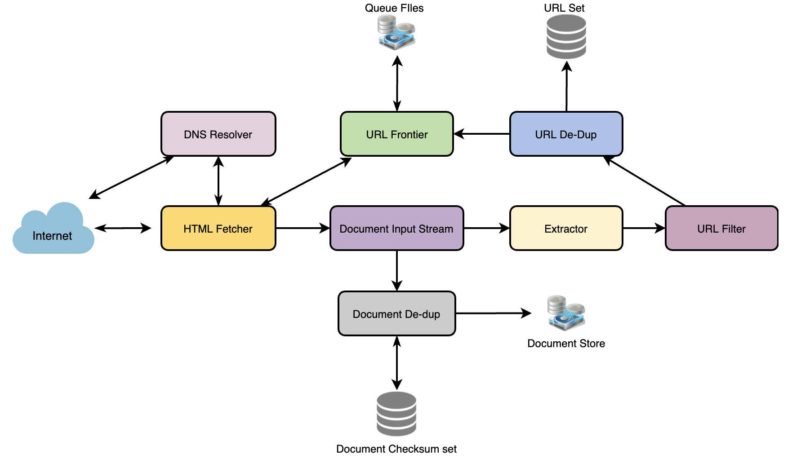

# Web Crawler

* Scalability: Need to be scalable ST can crawl entire Web and can be used to fetch hundreds of millions of Web documents

* Extensibility: Should be designed in a modular way with the expectation that new functionality will be added to it
  * There could be newer document types that need to be downloaded and processed in the future

* Difficulty?
  * Large volume of Web pages, Rate of change on web pages

## Architecture

* 

* Logic
  1. Pick a URL from the unvisited URL list.
  1. Determine the IP Address of its host-name.
  1. Establish a connection to the host to download the corresponding document.
  1. Parse the document contents to look for new URLs.
  1. Add the new URLs to the list of unvisited URLs.
  1. Process the downloaded document, e.g., store it or index its contents, etc.
  1. Go back to step 1

* Domain name resolution: Before contact Web server, crawler must use DNS to map Web server’s hostname into an IP address
  * DNS name resolution will be a big bottleneck of our crawlers given the amount of URLs we will be working with
  * To avoid repeated requests, we can start caching DNS results by building our local DNS server.

* URL dedupe test: Same website multiple, different URLs
  * Calculate a 64-bit checksum of every processed document and store it in a database
  * 15B * 4 bytes (Checksum) => 60 GB
  * Bloom Filter
    * [-] false positive will cause URL not to be added to frontier and, therefore, the document will never be downloaded
* URL filters: The URL filtering mechanism provides a customizable way to control the set of URLs that are downloaded
  * Before adding each URL to the frontier, the worker thread consults the user-supplied URL filter to blacklist websites
  * We can define filters to restrict URLs by domain, prefix, or protocol type
* URL frontier: URL frontier is data structure that contains all URLs that remain to be downloaded
  * Crawl by performing a breadth-first traversal of the Web, starting from the pages in the seed set, using queue

* Only HTML pages? Or should we fetch and store other types of media, such as sound files, images, videos, etc.?
  * If we are writing a general-purpose crawler to download different media types
  * Break down parsing module into different sets of modules: HTML, images, videos, where each module extracts its type

* What different protocols should our crawler handle? (ex: HTTP, FTP)
  * For sake of exercise, assume HTTP. Again, it shouldn’t be hard to extend design to use FTP and other protocols later

* What is ‘RobotsExclusion’ and how should we deal with it?
  * robot.txt which contains these declarations from a Web site before downloading any real content from it

## Database

* 15B / (4 weeks x 7 days x 86400 sec) ~= 6200 pages/sec

* Data Partitioning
  * Three kinds of data: 1) URLs to visit 2) URL checksums for dedupe 3) Document checksums for dedupe
* What is the expected number of pages we will crawl? How big will the URL database become?
  * Let’s assume we need to crawl one billion websites
